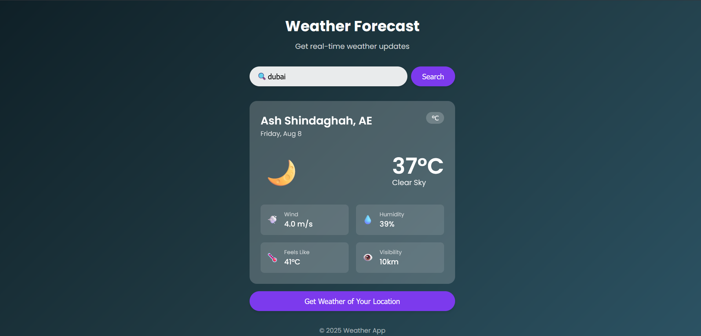

# 🌤️ Weather App

[](LICENSE)

A simple and elegant React weather application that shows **real-time weather updates** for any location using the [OpenWeather API](https://openweathermap.org/api).  
It supports:
- **Search by city name**
- **Get your local weather** via geolocation
- Dynamic **background themes** based on weather conditions
- Mobile-friendly responsive design

---

## 🚀 Features

- **🔍 Search Weather** – Enter a city name to get current weather conditions.
- **📍 Get Your Location Weather** – Detects your location and shows local weather instantly.
- **🌗 Dynamic Backgrounds** – Background changes depending on weather and time (day/night).
- **📊 Weather Details** – Includes temperature, description, wind speed, humidity, feels-like, and visibility.
- **⚡ Loading Indicator** – Shows a loader while fetching data.

---

## 🖼️ Preview



---

## 🛠️ Tech Stack

- **React** – Frontend framework
- **Axios** – API requests
- **OpenWeather API** – Weather and geocoding data
- **CSS Modules** – Styling
- **Vite** – Build tool for faster development

---

## 📦 Installation

### 1️⃣ Clone the Repository
```bash
git clone https://github.com/shaileshadole/WeatherApp.git
cd weather-app
```

2️⃣ Install Dependencies
```bash
npm install
```

3️⃣ Create an .env File
Create a .env file in the root directory and add your OpenWeather API key:
```bash
VITE_OPENWEATHER_API_KEY=your_api_key_here
```
You can get your free API key from OpenWeather.

4️⃣ Run the App
```bash
npm run dev
```
The app will be running at:
```
http://localhost:5173
```
## 📂 Project Structure

```
src/
 ├── Components/
 │   ├── Query.jsx         # Search bar & location query
 │   ├── NoWeather.jsx     # Display when no data is available
 │   ├── WeatherCard.jsx   # Weather info display card
 │   ├── Loader.jsx        # Loading animation
 │
 ├── App.jsx               # Main app logic
 ├── App.module.css        # App styles
 ├── main.jsx              # Entry point
📸 Screenshots
```

## 📝 License
This project is licensed under the MIT License – feel free to modify and use it.

## 💡 Future Improvements
Add hourly & 7-day forecast

Dark mode toggle

Save favorite cities

## 🧑‍💻 Author

**Shailesh Adole**  
GitHub: [shaileshadole](https://github.com/shaileshadole)

---

## 🚀 Let's Connect

- 🌐 [LinkedIn](https://www.linkedin.com/in/shailesh-adole-01306a303/)
- ✉️ [Email](adoleshailesh2@gmail.com)

---

## 📄 License

This project is licensed under the [MIT License](LICENSE).
